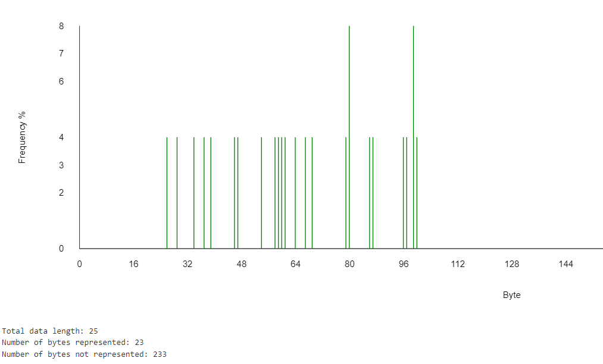

Analyse
=======

Les amateurs du podcast *La French Connesction* ont remarqué depuis
longtemps que le logo du dit podcast présente, en son bas, une
mystérieuse inscription qui recèle sans aucun doute un message secret
(Figure 1).

Le message chiffré
------------------

Le mystérieux chiffre est composé de 25 nombres hexadécimaux. Il est
souvent plus facile de convertir les nombres hexadécimaux en nombre
décimaux. [CyberChef](https://gchq.github.io/CyberChef/) se charge très
bien de ce genre de besogne (Table 1).

Figure 1 : Logo du podcast La French Connection.

Table 1 : Mystérieux chiffre.

     4E 39 44 60 35 63 3B 19 24 55 62 3A 2E 4F 56 42 4F 2D 21 3F 62 1C 26 3C 5F
     78 57 68 96 53 99 59 25 36 85 98 58 46 79 86 66 79 45 33 63 98 28 38 60 95

Fréquences
----------

Puisque nous mettons déjà à profit CyberChef, aussi bien en profiter
pour faire une analyse en fréquence. La Figure 2 montre le résultat de cette
analyse. On constate que sur 25 nombres, seulement deux sont répétés (4F
et 62). En même temps, la séquence n'est pas aléatoire puisque les
valeurs ne sont pas réparties uniformément sur la plage des 256 nombres
possibles (de 00 à FF).

Figure 2 : Analyse de la fréquence des nombres.

Ces résultats nous permettent d'exclure un chiffrement moderne ou une
fonction de hachage qui produirait des données plus uniformes. De plus,
on n'a pas non plus affaire à un simple chiffre de substitution
puisqu'il y a peu de répétitions. Le message chiffré étant très court,
il est difficile de faire une analyse statistique plus poussée ou
d'utiliser la force brute sans avoir identifié la méthode de
chiffrement.

En regardant plus attentivement les nombres décimaux, on remarque
qu'aucun ne se termine par 1, 2 ou 4. De plus, les chiffres des unités
ne sont pas répartis uniformément, tel qu'illustré à la Table 2. La répartition
du chiffre des dizaines est un peu plus uniforme, mais on note l'absence
de tout chiffre plus petit que 20 (Table 3).

Table 2 : Répartition du chiffre des unités.
  
     Unité       %
       0         4       
       3        12
       5        16
       6        20
       7         4
       8        28
       9        16

  

  Table 3 : Répartition du chiffre des dizaines.
  
     Dizaine       %
        2          8
        3         12
        4          8
        5         16
        6         16
        7         12
        8          8
        9         20
